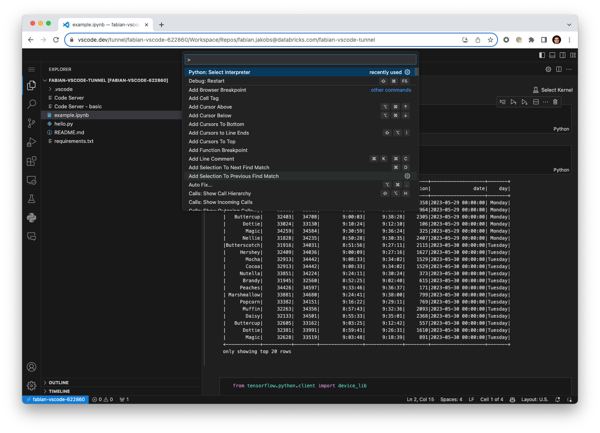
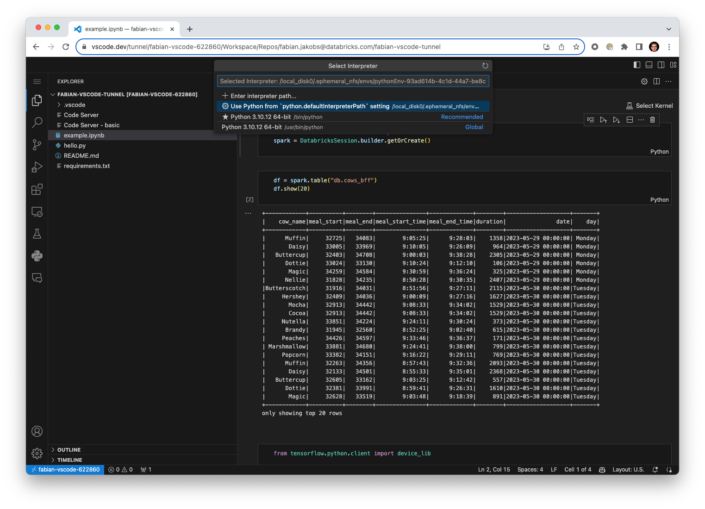
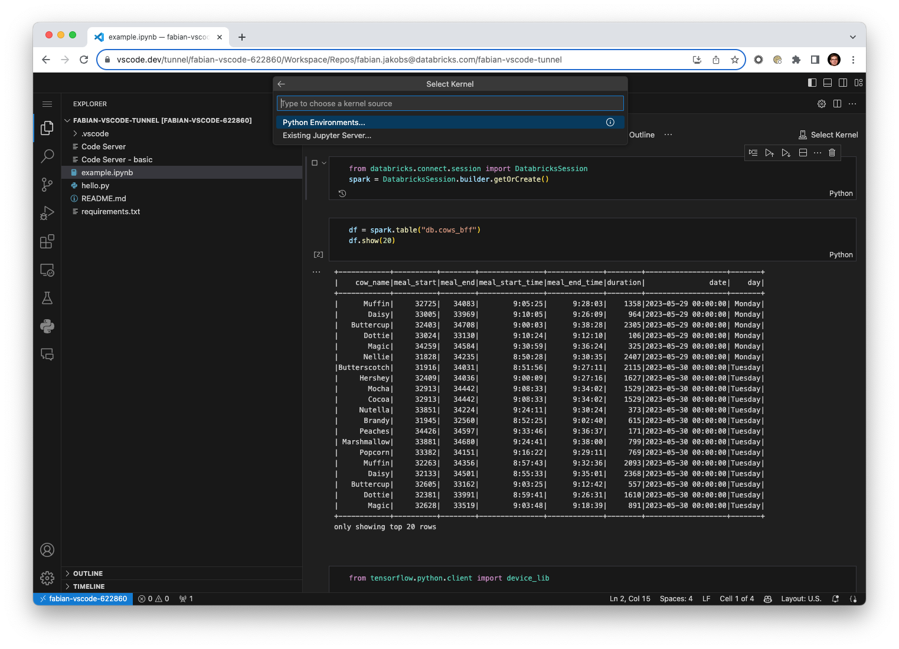
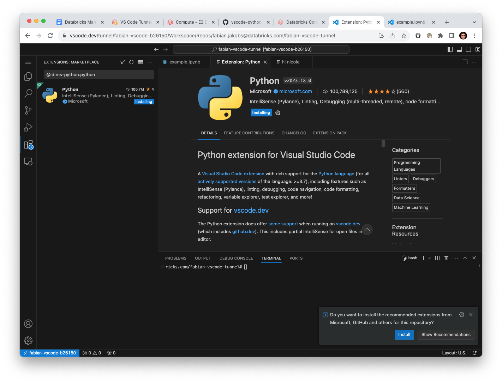

# VS Code Tunnel for Databricks Projects

This Repo contains a proof of concept for connecting VS Code to a Databricks cluster by using [VS Code Tunnels]([url](https://code.visualstudio.com/docs/remote/tunnels)).

## Disclaimer
- The product is in preview and not intended to be used in production;
- The product may change or may never be released;
- While we will not charge separately for this product right now, we may charge for it in the future. You will still incur charges for DBUs.
- There's no formal support or SLAs for the preview - so please reach out to your account or other contact with any questions or feedback; and
- We may terminate the preview or your access at any time;

## Demo

[](https://vscode-extension-databricks.s3.amazonaws.com/debugging_notebooks.mp4)


## Features

- Full debugger support for Python files
- Jupyter notebooks
- Debugger works in python scripts and notebooks
- Access to all cluster libraries
- Full Python LSP including code completion for spark
- UC support

## Limitations

- Requires UC and DBR >= 14.x (because of SparkConnect)
- Only SparkConnect and DBUtils from SparkConnect
- No dbutils widgets
- Notebooks written in VSCode don't show up in Databricks (needs DBR >= 17.2)
- Notebooks written in Databricks can't be opened in VSCode (needs DBR >= 16)
- No git support in VS Code. Code needs to be committed from Databricks (WIP)
- VS Code
  - Extensions aren't installed automatically
  - In order to persist extensions they need to be listed in .vscode/extensions.json
  - Python virtual environment needs to be selected manually using Python: Select Interpreter command

## Installation

1. Create a supported cluster
   - UC enabled
   - Minimal DBR 14.x or MLR 14.x
   - Single-user mode 
   - Consider turning off automatic termination as restarting the cluster resets the IDE tunnel and state   
2. Select or create a folder in Databricks. This can either be a Repo or a folder in the Databricks Workspace.
   - Import the `VS Code Tunnel` notebook into the project folder
   - Open the notebook and select the cluster from step 1
   - Run all cells
3. Open the IDE
   - The last cell might print a link to GitHub and a confirmation code. Open the link and paste the confirmation code to establish the tunnel
   - Finally, a link to vscode.dev is printed, which opens the IDE

## Configure Python Environment

After opening the IDE run the `Python: Select interpreter` command and select the recommended environment:

Select Python Interpreter
ℹ️ Please select "Use Python from the python.defaultInterpreterPath ... " option




## Using Notebooks

In order to use notebooks you have to create a file with the `.ipynb` extension. Then click `Select Kernel` and select the virtual environment attached to the project.



Note that the notebook doesn't know about the Databricks globals such as `spark` or `dbutils`. You can get references to them by importing them implicitly:

```python
from databricks.sdk.runtime import *
```

This code will also work in VSCode and in Databricks notebooks.


## Install Recommended Extensions

Extensions are installed on the driver node and will not persist across cluster restarts. You can keep a list of extensions to be installed in `.vscode/extensions.json` and then accept installing recommended extensions the first time the IDE is opened.


# vscode-tunnel-0.3
